# 🚛 Tırdaş - Yapay Zeka Destekli Lojistik WhatsApp Asistanı

> **Not:** Bu proje özel sipariş üzerine ticari bir ürün olarak geliştirilmiş olup, gizlilik anlaşmaları (NDA) ve ticari sır niteliği sebebiyle kaynak kodları kapalı tutulmaktadır. Bu doküman, projenin mimarisini, kullanılan teknolojileri ve geliştirme sürecindeki mühendislik çözümlerini sergilemek amacıyla hazırlanmış bir vaka analizidir (Case Study).

## 📌 Proje Özeti
**Tırdaş**, lojistik sektöründe çalışan tır ve kamyon şoförlerinin yoldayken ihtiyaç duydukları her şeye (yük bulma, hava durumu, mekan arama, gider takibi vb.) doğrudan WhatsApp üzerinden ulaşabilmelerini sağlayan **Yapay Zeka (LLM) tabanlı otonom bir asistandır.** 

Şoförlerin karmaşık arayüzler öğrenmesine veya uygulama indirmesine gerek kalmadan, tamamen doğal dille (Örn: *"Bolu'da yemek yenecek yer var mı?"*, *"İstanbul'dan Ankara'ya yük lazım"*, *"5000 TL mazot aldım"*) iletişim kurarak sistemle etkileşime girmesi sağlanmıştır. Proje, otonom bir Node.js backend servisi ile veriyi anlamlandıran gelişmiş bir Python (Streamlit) Yönetim Paneli'nden oluşmaktadır.

---

## 🛠️ Kullanılan Teknolojiler (Tech Stack)

* **Backend (Core):** Node.js, Express.js
* **Yapay Zeka & NLP:** OpenAI API (`gpt-4o-mini`), Prompt Engineering
* **WhatsApp Entegrasyonu:** `@whiskeysockets/baileys` (WebSockets)
* **Veritabanı:** PostgreSQL (Supabase), SQL, Connection Pooling
* **Yönetim Paneli (Admin UI):** Python, Streamlit, Pandas, Plotly, SQLAlchemy
* **Harita ve Konum Servisleri:** Google Maps API (Places/Text Search), Geolocation (Haversine Algorithm)
* **Dış Servisler:** OpenWeather API, Diyanet Namaz Vakitleri (Scraping/API), Iyzico (Ödeme Altyapısı), Telegram API (Alerts)
* **DevOps & Deployment:** Docker, PM2 (Process Manager), Node-Cron, Windows Batch Scripting (Automated Backups)

---

## 🚀 Öne Çıkan Özellikler ve Modüller

1. **Doğal Dil İşleme (NLP) ile Yük Eşleştirme:** Gruplardan veya kullanıcılardan gelen yapılandırılmamış, emojili ve karmaşık yük ilanlarını (Örn: *"🚛 İZMİR -> ANKARA KAPALI KASA 15 TON"*) OpenAI kullanarak analiz eder, yapılandırılmış JSON verisine çevirir ve veritabanına kaydeder.
2. **Konum Bazlı Hizmetler:** Şoförlerin WhatsApp üzerinden gönderdiği anlık konumu alarak; en yakın lastikçi, dinlenme tesisi, lokanta gibi noktaları kuş uçuşu mesafe (Haversine formülü) ile hesaplayıp Google Maps linkleriyle birlikte sunar.
3. **Otonom Finans & Kota Sistemi:** Kullanıcıların ücretsiz ve premium üyeliklerini, günlük/aylık API sorgu kotalarını ve sanal cüzdanlarını otomatik yönetir.
4. **Gerçek Zamanlı Admin Paneli:** Python Streamlit ile geliştirilen panel üzerinden; anlık WhatsApp bağlantı durumu izlenebilir, şüpheli ilanlar manuel onaylanabilir, kullanıcılara canlı destek (AI-Bypass) verilebilir ve sistem metinleri (No-Code Prompt UI) anında güncellenebilir.

---

## 🧠 Mühendislik Zorlukları ve Geliştirdiğim Çözümler

Bir "Chatbot" yapmanın ötesine geçerek, binlerce kullanıcının eşzamanlı ve asenkron veri akışını yönetirken karşılaştığım temel sorunlar ve ürettiğim mühendislik çözümleri:

### 1. WhatsApp Anti-Ban & Spam Koruması (Rate Limiting)
* **Zorluk:** WhatsApp politikaları gereği botların insan doğasına aykırı hızda (milisaniyeler içinde) cevap vermesi veya spam yapması hesabın kapatılmasına (ban) yol açar. Ayrıca kötü niyetli kullanıcıların DDoS benzeri aşırı mesaj atması API maliyetlerini (OpenAI) patlatabilirdi.
* **Çözüm:** 
  * Özel bir **Split-Cache (İkili Önbellek)** ve **Concurrency Lock (İşlem Kilidi)** mimarisi geliştirdim. Mükerrer gelen uzun mesajlar 15 dakika, kısa komutlar 5 saniye hafızada tutularak işleme alınmadan düşürüldü (Silent Drop).
  * İnsan davranışını simüle etmek için mesajın karakter sayısına göre hesaplanan dinamik bir "Yazıyor..." (`composing`) bekleme süresi ve gecikmeli "Mavi Tik" (`readMessages`) fonksiyonu entegre ettim.
  * 3 aşamalı (5 Dk, 30 Dk, 24 Saat) otomatik muting (susturma) algoritması yazarak spam yapanları otonom olarak cezalandıran bir güvenlik katmanı kurdum.

### 2. LLM Hallucination (Yapay Zeka Halüsinasyonu) ve Veri Standardizasyonu
* **Zorluk:** Şoför jargonunda yazılan şehir adlarını (Örn: *"Antep", "İzmit", "Kazan"*) veya alakasız sohbet mesajlarını yapay zekanın yanlışlıkla yük ilanı veya yanlış şehir olarak algılaması.
* **Çözüm:** 
  * Yapay zeka ile veritabanı arasına `CityValidator` adında bir katman yazdım. AI'dan gelen tüm veriler Türkiye'nin 81 il ve 973 ilçesinin bulunduğu bir hash-map üzerinden doğrulanıyor, jargona özel kelimeler ("Antep" -> "Gaziantep") otonom olarak düzeltiliyor.
  * Gelişmiş Prompt Engineering teknikleri ile AI'a "Başlıklı Liste Kuralı", "Yön Ayraçları" gibi çok katı kurallar tanımladım ve doğruluğu şüpheli olan ilanları yayınlamak yerine Admin Paneline "Onay Bekleyenler" (Suspicious) sekmesine düşürdüm.

### 3. Veritabanı ve Panel Performansı (Bottleneck)
* **Zorluk:** Veritabanındaki binlerce mesaj ve ilanın Streamlit admin panelinde gerçek zamanlı listelenmesi, her tıklamada (sayfalamada) ağır SQL `COUNT(*)` sorguları oluşturarak sistemi kilitliyordu.
* **Çözüm:** 
  * PostgreSQL tarafında sık sorgulanan sütunlara (`created_at`, `status`, `phone_id`) **B-Tree Indexler** eklendi.
  * Streamlit tarafında `@st.cache_data(ttl=300)` ve `@st.cache_resource` wrapper'ları kullanılarak ağır ayar dosyaları, CSS dosyaları ve analitik sayım sorguları **RAM'e (Önbelleğe)** alındı. Veritabanı için `pool_size=10` bağlantı havuzu (Connection Pooling) kurularak panel tepki süresi %300 hızlandırıldı.

### 4. Hata Yönetimi ve Sistem Dayanıklılığı (Resilience)
* **Zorluk:** Dış API'lerde (Google, OpenAI) oluşabilecek kota aşımları, sunucu ağ kopmaları durumunda botun çökmemesi ve verinin kaybolmaması gerekiyordu.
* **Çözüm:** 
  * PostgreSQL bağlantısı için **Retry Pattern (Yeniden Deneme)** algoritması kurdum (Artan gecikmelerle 3 kez dener).
  * Herhangi bir kritik hata, try-catch bloklarında yakalanarak (örneğin API 429 Too Many Requests) kullanıcıya dostane bir dille *"Şu an sistem yoğun"* mesajı dönülürken, aynı anda Axios aracılığıyla **Telegram Bot API** üzerinden sistem yöneticisine anlık hata/log bildirimi (Alert) gönderen bir asenkron servis yazdım.

---

## 🎯 Rolüm ve Kazanımlarım

Bu projede **Full-Stack Developer, Data Engineer ve System Architect** rollerini tek başıma üstlendim. Müşteri ihtiyaçlarını dinlemekten başlayarak; sistem tasarımını oluşturma, veritabanı şemalarını modelleme, yapay zeka entegrasyonu sağlama ve ürünü canlı ortama alma (Deployment) süreçlerinin tamamını uçtan uca yönettim.

**Kazanımlarım:**
- LLM'leri (Large Language Models) sadece bir chatbot olarak değil, yapılandırılmamış veriyi işleyen bir veri ayrıştırma (Data Parsing) motoru olarak kullanma deneyimi.
- Gerçek zamanlı ve asenkron veri akışlarında (WebSockets & Chat) yüksek eşzamanlılık (concurrency), race-condition ve rate-limit problemlerini çözme becerisi.
- Python (Data manipulation) ve Node.js (Asynchronous I/O) dünyalarının en iyi yönlerini bir araya getirerek hibrit sistem mimarileri kurma tecrübesi.
- Bağımsız, otonom çalışan ve kendi hatalarını Telegram üzerinden raporlayıp, kendi yedeklerini alan (Self-Healing & Automated) sistemler geliştirme vizyonu.

### 📸 Ekran Görüntüleri

<h4 align="center">Tanıtım</h4>
<table align="center">
  <tr>
    <td align="center">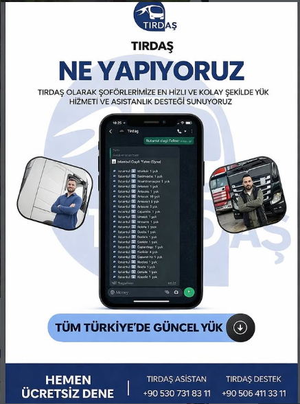</td>
  </tr>
 <tr>
    <td align="center"></td>
  </tr>
</table>
 
<h4 align="center">📱 WhatsApp Bot Arayüzünden Bazı Ekran Görüntüleri</h4>
<table align="center">
  <tr>
    <td align="center">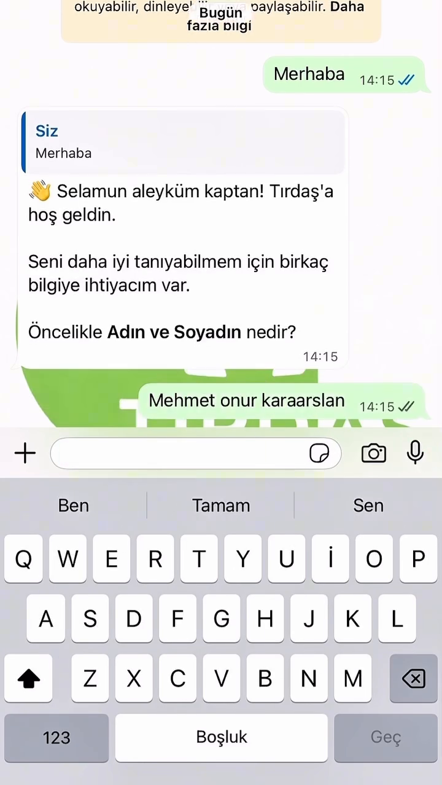</td>
    <td align="center">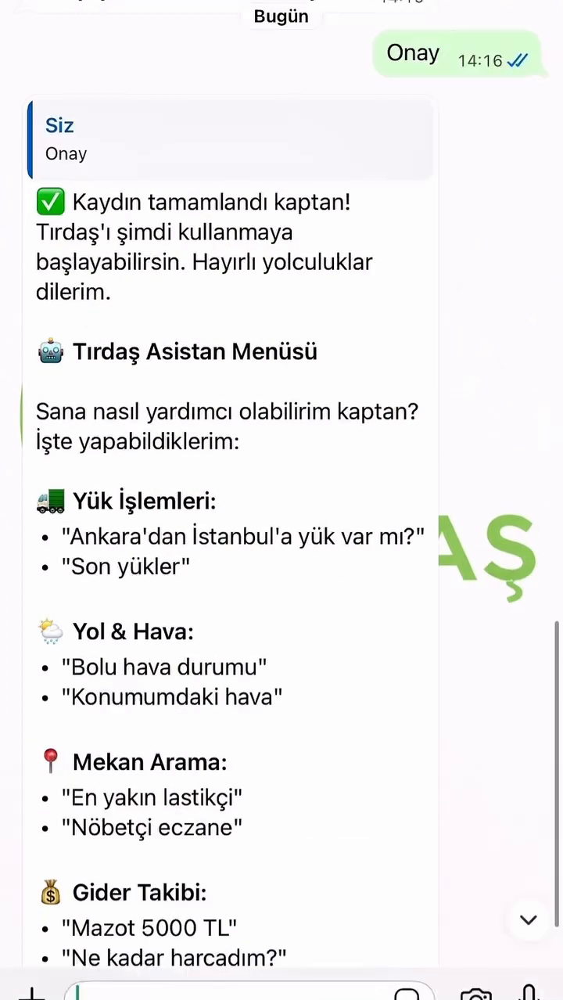</td>
   <td align="center">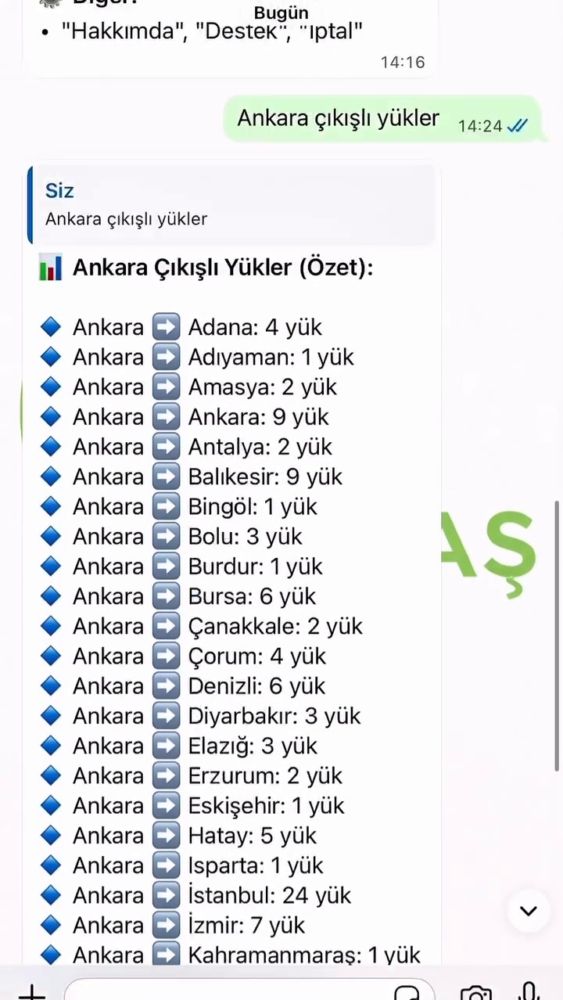</td>
  </tr>
  <tr>
    <td align="center">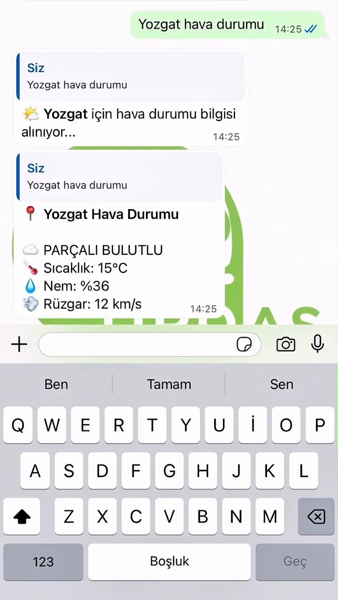</td>
    <td align="center">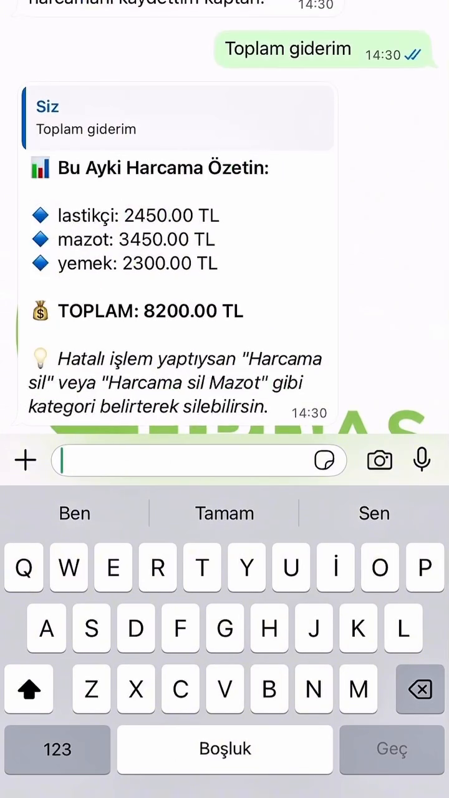</td>
    <td align="center">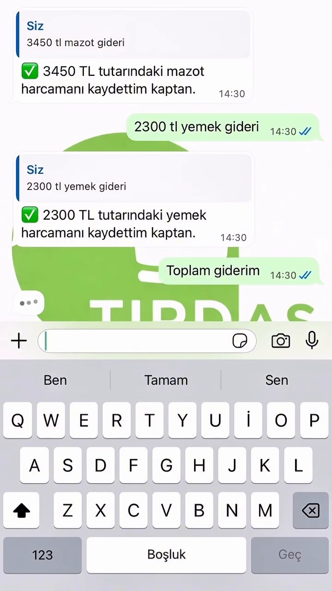</td>
  </tr>
</table>
 
<h4 align="center">💻 Streamlit Admin Panelinden Bazı Ekran Görüntüleri</h4>
<table align="center">
  <tr>
    <td align="center">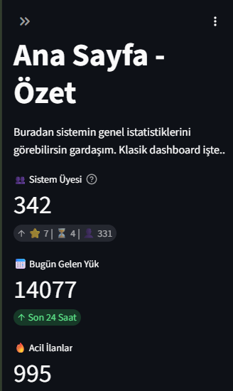</td>
    <td align="center">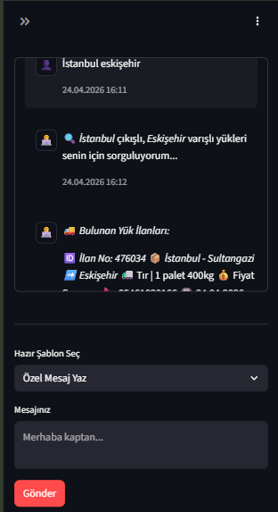</td>
  </tr>
  <tr>
    <td align="center">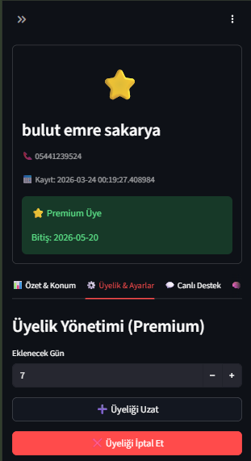</td>
    <td align="center">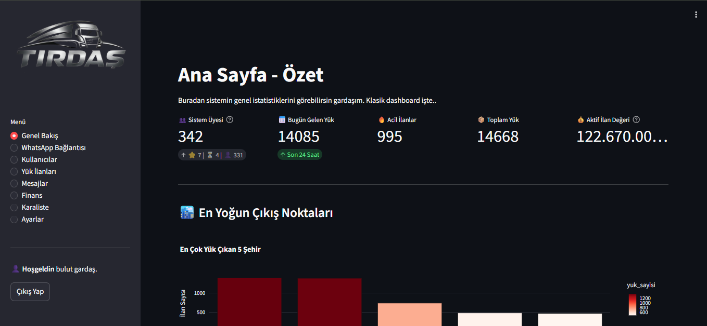</td>
  </tr>
</table>
 
<h4 align="center">▶️ Tırdaş Otonom İşleyiş ve Yönetim Paneli Demosu</h4>

  <video src="https://github.com/user-attachments/assets/83e3f404-60ca-4579-9681-125823bb0110" autoplay="autoplay" loop="loop" muted="muted" playsinline="playsinline" width="100%" style="max-width: 800px; border-radius: 2px;">
  </video>
   

 
---

**Geliştirici:** Bulut Emre Sakarya
**Tarih:** Mart-Nisan 2026
